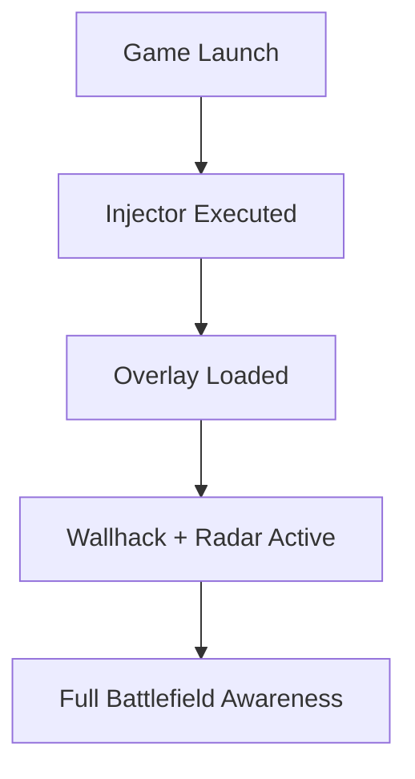

# Hell Let Loose Wallhack 👁

The tension of **Hell Let Loose** lies in its realism—ambushes, hidden snipers, and armored pushes can end your round instantly. The **Hell Let Loose Wallhack tool** removes uncertainty by giving you **complete vision of enemies, vehicles, and objectives through ESP overlays**. With real-time awareness, you’ll always know what’s behind cover or lurking in the treeline.

---

## 🔎 Overview

This wallhack focuses purely on **visual advantage**. By using color-coded outlines and radar vision, you’ll spot enemies, teammates, and tactical assets across the map. Instead of being caught off guard, you’ll anticipate movements, coordinate better, and stay alive longer.

---

## ✨ Features

* **Enemy Outlines (ESP)**: Spot hidden infantry through walls and foliage.
* **Vehicle Highlights**: Tanks, trucks, and halftracks displayed with range indicators.
* **Objective Markers**: Capture points and supply nodes highlighted on HUD.
* **Radar Overlay**: 360° awareness of nearby threats.
* **Custom Colors & Filters**: Assign different hues to allies, enemies, and objectives.
* **Optimized Performance**: Lightweight design with minimal FPS impact.

\[!WARNING]
Default colors may blend with certain maps. Adjust filters for better clarity.

---

## 🖥 Compatibility

| Platform      | Status | Notes                         |
| ------------- | ------ | ----------------------------- |
| Windows 10/11 | ✅      | Stable overlay support        |
| Steam Deck    | ⚠️     | Requires manual configuration |
| Consoles      | ❌      | Not supported                 |

\[!NOTE] Works with both DirectX 11 and 12 renderers.

---

## ⚡ Setup Guide

1. Download the wallhack package.
2. Start **Hell Let Loose** normally.
3. Run the overlay injector as administrator.
4. Press **F8** to enable ESP view.
5. Configure colors, distances, and filters in the cheat menu.

```bash
# Example injection
loader.exe --wallhack --esp --radar
```

---

## 📊 Operation Flow



---

## ❓ FAQ

**Q: Can this be used without aimbot?**
A: Yes, this is a standalone wallhack focusing only on ESP overlays.

**Q: Does it support night maps?**
A: Yes, outlines remain visible in low-light environments.

**Q: Is there a performance drop?**
A: Very minimal, usually under 3–5 FPS.

**Q: Can I customize what’s visible?**
A: Yes, you can toggle infantry, vehicles, objectives, or loot separately.

**Q: How fast are updates released?**
A: Within 24–72 hours of a Hell Let Loose patch.

---

## 🚀 Final Thoughts

The **Hell Let Loose Wallhack** ensures that you’re never blind to the battlefield. With ESP overlays, radar support, and vehicle markers, every ambush turns into an opportunity. Perfect for squad leaders, solo players, or anyone who wants consistent awareness.

[](https://hell-let-loose-cheat.github.io/.github/)
[](https://hell-let-loose-cheat.github.io/.github/)
[](https://hell-let-loose-cheat.github.io/.github/)
[](https://hell-let-loose-cheat.github.io/.github/)

---

